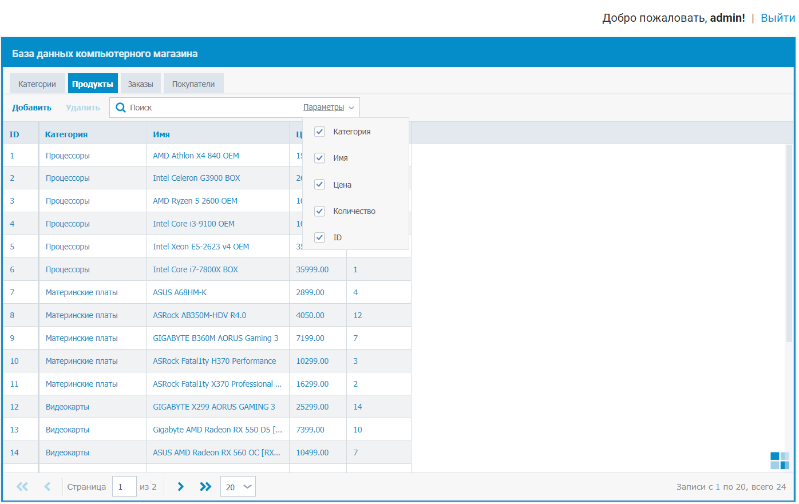

DBMS_Course
=============================

Программа для управления базой данных компьютерного магазина. Курсовая работа. Используется библиотека fancygrid.js.

Установка
------------

Измените конфигурацию в файле core/config.php. Выполните в MySQL файл dbms_course.sql. 
ПОльзователи хранятся в таблице users. Текущие пользователи: 
- admin:1762354 (администратор, может делать все)
- sergey:1234567 (пользователь, может только читать)
Права настраиваются в core/account.php.

Скриншоты
------------

